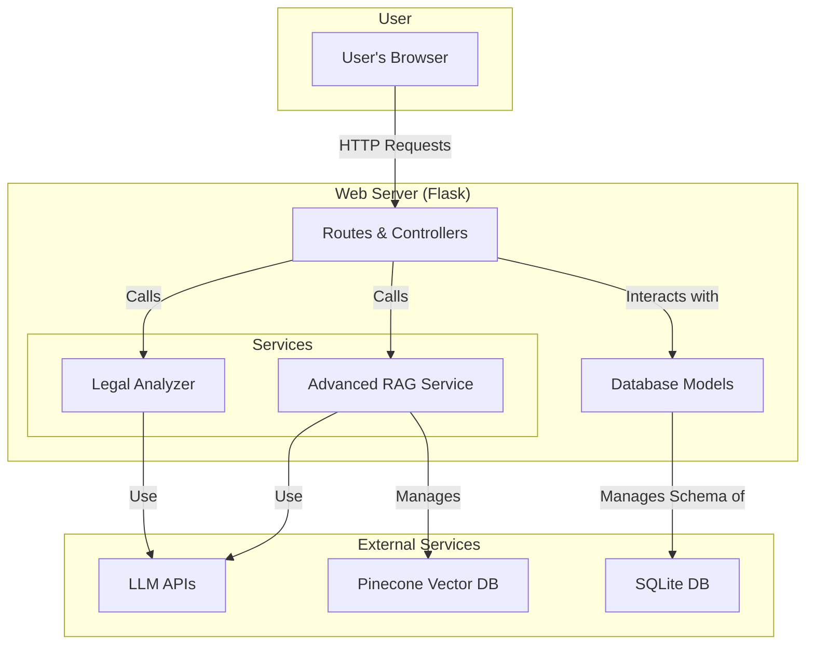

# LexDocuAI: Comprehensive Project Documentation

This document provides a complete overview of the LexDocuAI application, covering its purpose, features, technology stack, system architecture, workflows, and setup instructions. It is designed to be a single source of truth for developers and stakeholders.

## 1. Project Overview

LexDocuAI is an intelligent legal document analysis platform built to streamline the workflow of legal professionals. By leveraging advanced AI, including Large Language Models (LLMs) and a sophisticated Retrieval-Augmented Generation (RAG) pipeline, the application transforms the tedious task of document review into an efficient, interactive experience.

**Core Vision**: To empower users by allowing them to "chat" with their legal documents, asking complex questions and receiving accurate, context-aware answers instantly, thereby saving time and improving productivity.

## 2. Core Features

- **Secure Document Upload**: Supports `.pdf` and `.docx` file formats.
- **AI-Powered Legal Validation**: Automatically checks if an uploaded document is legal in nature and rejects it if it is not.
- **Intelligent Duplicate Handling**: Instead of blocking duplicates, the system deletes the old version (database record, file, and vector data) and replaces it with the new one, ensuring the chat is always with the latest document.
- **Automated Document Analysis**: Generates a comprehensive analysis upon upload, including a summary, document type, and key entity extraction.
- **Advanced Conversational AI (RAG Chat)**:
  - **Hybrid Search**: Combines semantic (dense) and keyword-based (sparse) search to retrieve the most relevant information chunks from documents.
  - **Cross-Encoder Re-ranking**: Refines the search results by using a Cross-Encoder model to score the relevance of each chunk to the user's query, ensuring maximum precision.
  - **Context-Aware Responses**: The LLM uses the re-ranked, highly relevant chunks to generate accurate and concise answers.
- **Chat Interface Restriction**: The chat functionality is enabled only for the most recently uploaded document to maintain focus and efficiency.

## 3. Technology Stack

| Category                | Technology/Service                                       |
| ----------------------- | -------------------------------------------------------- |
| **Backend Framework**   | Flask (Python)                                           |
| **Database**            | SQLite with SQLAlchemy ORM                               |
| **Frontend**            | HTML5, CSS3, Vanilla JavaScript                          |
| **Vector Database**     | Pinecone (for sparse-dense vector storage)               |
| **LLM Providers**       | Groq (for chat generation), DeepInfra (for embeddings)   |
| **AI Models**           | Llama 4 (chat), BAAI/bge-base-en-v1.5 (embeddings)       |
| **NLP & Search**        | spaCy, scikit-learn (TF-IDF), sentence-transformers      |
| **File Processing**     | PyPDF2, python-docx                                      |

## 4. System Architecture

The application employs a modular, service-oriented architecture designed for maintainability and scalability.



## 5. Detailed Workflows

### 5.1. Document Upload & Indexing

1.  **Upload**: User uploads a file via the browser.
2.  **Hashing**: The backend computes a SHA-256 hash of the file.
3.  **Duplicate Check**: The system checks if the hash exists in the database. If yes, the old document and its associated data are deleted.
4.  **Validation**: An LLM validates if the document is a legal text. If not, the upload is rejected.
5.  **Indexing**: 
    - The document is chunked semantically.
    - For each chunk, both a **dense vector** (for meaning) and a **sparse vector** (for keywords) are generated.
    - These sparse-dense vectors are stored in the Pinecone index, which is configured with the `dotproduct` metric to support hybrid search.

### 5.2. Advanced RAG Chat Flow

1.  **Query**: User submits a question in the chat interface.
2.  **Rewrite**: The query is first rewritten by an LLM to be more effective for semantic search.
3.  **Hybrid Search**: The rewritten query is used to perform a hybrid search in Pinecone, retrieving an initial set of candidate chunks based on both semantic and keyword relevance.
4.  **Re-ranking**: The candidate chunks are passed to a **Cross-Encoder model**, which re-ranks them based on their direct relevance to the original query.
5.  **Context Building**: The top-ranked chunks are selected to form the context.
6.  **Answer Generation**: The context and the user's question are sent to the final LLM, which generates a concise and accurate answer.

## 6. Project Structure

```
lexdocuai/
├── app/                    # Main application package
│   ├── services/           # Business logic (RAG, LLM, etc.)
│   ├── static/             # CSS, JS, images
│   ├── templates/          # HTML files
│   ├── __init__.py         # App factory
│   ├── models.py           # SQLAlchemy models
│   └── routes.py           # Flask routes
├── instance/               # Instance-specific data (e.g., SQLite DB)
├── uploads/                # Directory for uploaded files
├── .env                    # Environment variables
├── config.py               # Application configuration
├── requirements.txt        # Python dependencies
├── init_db.py              # Script to initialize the database
└── run.py                  # Entry point to run the application
```

## 7. Setup and Installation

1.  **Clone the Repository**:
    ```bash
    git clone <repository-url>
    cd lexdocuai
    ```
2.  **Create a Virtual Environment**:
    ```bash
    python -m venv venv
    source venv/bin/activate  # On Windows: venv\Scripts\activate
    ```
3.  **Install Dependencies**:
    ```bash
    pip install -r requirements.txt
    python -m spacy download en_core_web_sm
    ```
4.  **Configure Environment Variables**:
    - Create a `.env` file in the root directory.
    - Add your API keys and Pinecone configuration:
      ```env
      GROQ_API_KEY=your_groq_key
      DEEPINFRA_API_KEY=your_deepinfra_key
      PINECONE_API_KEY=your_pinecone_key
      ```
5.  **Initialize the Database**:
    ```bash
    python init_db.py
    ```
6.  **Run the Application**:
    ```bash
    python run.py
    ```

## 8. Configuration

- **`config.py`**: Contains all static configurations for the application, such as upload folder paths, file size limits, and Pinecone settings (index name, dimension, etc.).
- **`.env`**: Stores all sensitive information like API keys. This file is loaded at runtime and should not be committed to version control.

## 9. Future Improvements

- **Multi-Document Chat**: Extend the chat functionality to query across multiple documents.
- **User Authentication**: Implement user accounts to provide a personalized and secure experience.
- **Asynchronous Processing**: Move file analysis and indexing to a background task queue (e.g., Celery) to improve UI responsiveness.
- **Enhanced UI/UX**: Add more interactive elements, loading indicators, and a more polished design.
